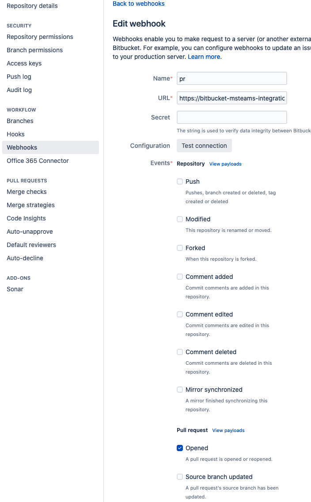
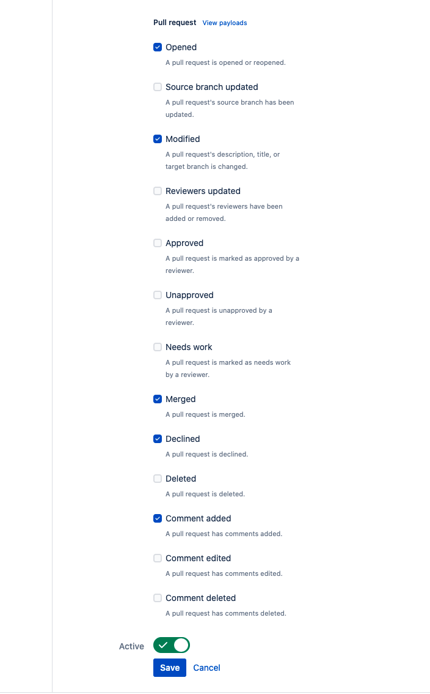

# Overview

This repo `bitbucket-pr-integration-msteams` supports the Bitbucket webhook functionality to send PullRequest updates to a MSTeams channel with a Incoming Webhook connnection setup., with customizations 


As seen below in the documentation [Part 2 - Create Bitbucket Webhook](#part-2---create-bitbucket-webhook) the Bitbucket Webhook url will be  <span style="font-size:larger;">https://bitbucket-pr-integration-msteams.<company domain>?webhook=[insert teams webhook URL]</span>

This is two parts: 
1. base url: <span style="font-size:larger;">https://bitbucket-pr-integration-msteams.<company domain></span>
2. your webhook as a URL param: <span style="font-size:larger;">?webhook=[insert teams webhook URL]</span>

## Bitbucket setup

### Part 1 - Create and retrieve MSTeams webhook
- Setup a channel in Teams like "Pull Requests"
- Configure the Incoming Webhook connector - capture (copy) the incoming webhook URL from the connector

### Part 2 - Create Bitbucket Webhook
- Create the URL
  https://bitbucket-pr-integration-msteams.<company domain>?webhook=[insert teams webhook URL]
- In the bitbucket repository navigate to Settings -> Webhooks.
- Add the following one webhook for each of the following events:
  Pull Request - Opened, Pull Request - Source Branch Updated, Pull Request - Modified, Pull Request - Merged, Pull Request - Declined, Pull Request - Comment added, (add more if desired although it may be too verbose in the Teams channel)


Recommended settings in Bitbucket:





### Deployment

This is any AWS account that has access to on-prem MSTeams url's if using Office 365 it is probably any AWS account.

### VSCode Development

`.vcode/launch.json`

```json
{
    // Use IntelliSense to learn about possible attributes.
    // Hover to view descriptions of existing attributes.
    // For more information, visit: https://go.microsoft.com/fwlink/?linkid=830387
    "version": "0.2.0",
    "configurations": [
        {
            "type": "node",
            "name": "vscode-jest-tests",
            "request": "launch",
            "args": [
                "--runInBand"
            ],
            "cwd": "${workspaceFolder}",
            "console": "integratedTerminal",
            "internalConsoleOptions": "neverOpen",
            "program": "${workspaceFolder}/node_modules/jest/bin/jest",
            "outputCapture": "std",
            "skipFiles": [
                "${workspaceFolder}/node_modules/**/*.js",
                "${workspaceFolder}/lib/**/*.js",
                "<node_internals>/**/*.js"
            ]
        },
        {
            "type": "node",
            "request": "launch",
            "name": "Launch Program",
            "program": "${workspaceFolder}/src/main.ts",
            "preLaunchTask": "npm: build:clean",
            "outFiles": [
                "${workspaceFolder}/dist/**/*.js"
            ],
            "outputCapture": "std",
            "skipFiles": [
                "${workspaceFolder}/node_modules/**/*.js",
                "${workspaceFolder}/lib/**/*.js",
                "<node_internals>/**/*.js"
            ],
            "env": {
            }
        }
    ]
}
```